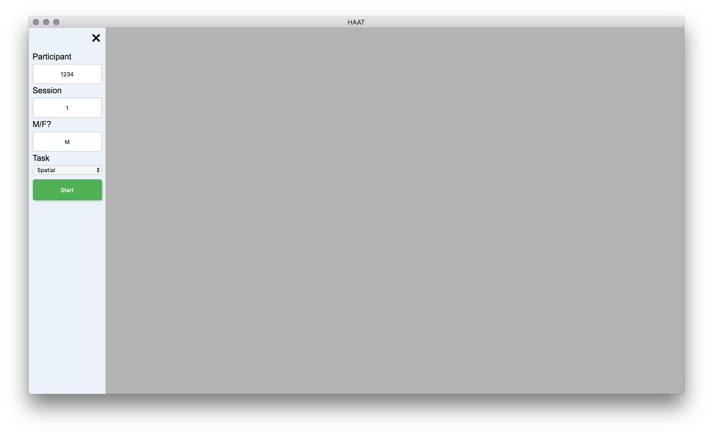
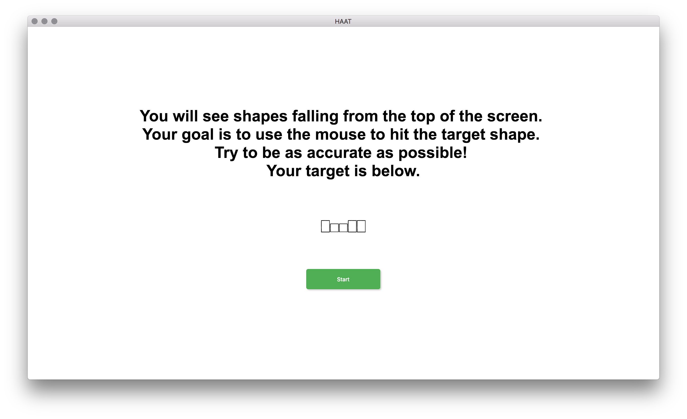
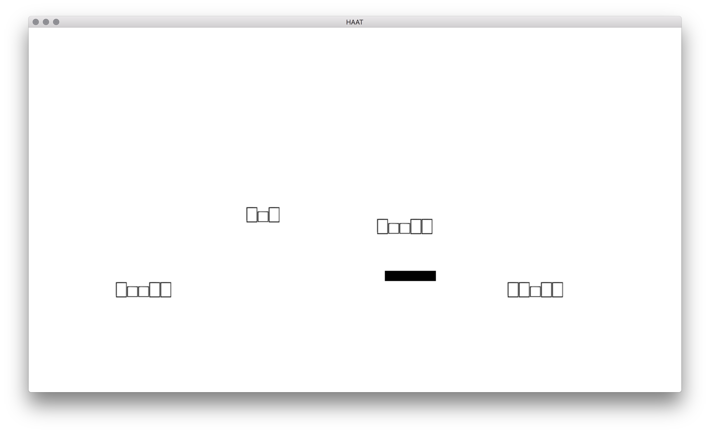
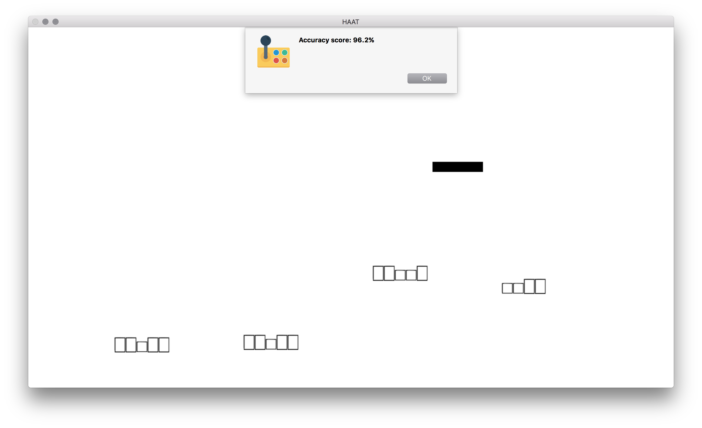

# HAAT

(Hit And Avoid Tasks)

##### Dowload the [latest version](https://github.com/hanayik/HAAT/releases/latest)

### Description
This task was designed specifically to investigate non-language related cognitive function in left hemisphere stroke participants for the CSTAR research group. However, in addition to the spatial version of the task, there are also semantic and phonological language tasks so that comparisons can be made within a participant. The goal for each of these tasks is for participants to use the mouse or touchpad to "hit" the targets (they vary by task), and to avoid all of the distracting elements that fall from the top of the screen. The task lasts for 2 minutes each session. See screenshots below for an illustration.

The saved data location will depend on your computer. The program automatically detects if you have Dropbox, or Box folders on your computer and tries to save to those locations first, in that order. If you do not wish to save to the cloud folders then uncheck that option in the menu bar. If the cloud saving option is unchecked, or those folders do not exist on your computer then the app will save to it's default MacOS location which is ``` ~/Library/Application Support/HAAT/data ```

This app uses my own [HapticJS](https://github.com/hanayik/hapticJS) npm module to provide haptic feedback to users with modern MacOS laptops that support haptic feedback using the touchpad


### Screenshots











### Credits
[Icon](http://www.flaticon.com/authors/dinosoftlabs)

[ffmpeg](https://www.ffmpeg.org/)

### License
[MIT](https://github.com/hanayik/HAAT/blob/master/LICENSE)

This app was made specifically for the CSTAR group, but is open source so that others may modify and use as desired.

### Developers
This app is currently only developed for MacOS, and a compiled version of ffmpeg is bundled with the app.

##### To clone repo:

``` cd /to/your/desired/install/location ```

``` git clone https://github.com/hanayik/HAAT.git ```

##### To install packages:

``` cd HAAT ```

``` npm install ```

##### To run

``` npm start ```


### Links
[CSTAR](https://cstar.sc.edu/)

[Aphasia Lab](https://web.asph.sc.edu/aphasia/)
